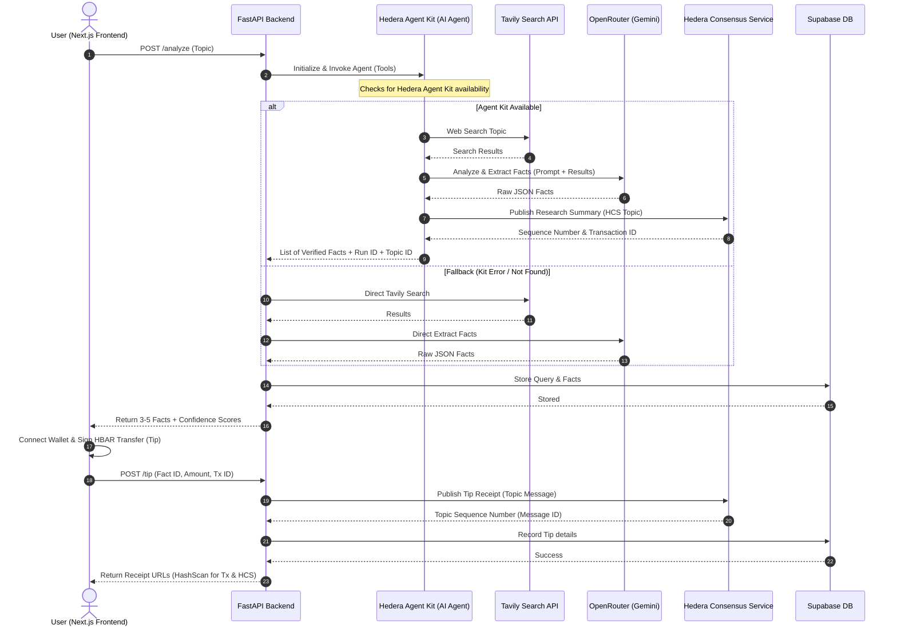

# Hello-Hedera-Pay

### AI-Powered Intelligence Platform with On-Chain HBAR Tipping & Immutable Audit Trails

Hello-Hedera-Pay is an enterprise-ready intelligence and research platform that allows users to query any topic, extract deep/underreported facts via advanced LLMs, and tip verified facts using on-chain HBAR. Every transaction and tipping event is recorded to the **Hedera Consensus Service (HCS)**, establishing a tamper-proof receipt of verified research and reward distribution.

---

## 🏗️ System Architecture

The following sequence diagram outlines the platform's core architecture, tracing both the AI research execution (using the **Hedera Agent Kit** and fallback pipelines) and the subsequent on-chain tipping and audit flow.



---

## 🛠️ How We Used Hedera-Agent-Kit

We integrated the **Hedera Agent Kit** in our Python backend ([ai_agent.py](file:///C:/Users/De%20real%20iManuel/Documents/Hello-Hedera-Pay/backend/app/services/ai_agent.py)) to create a smart, autonomous research agent. 

### 1. Agent Initialization & Tooling
The backend dynamically checks for the presence of the kit and imports the `HederaAgentKit` class. It is initialized using the operator's account credentials and network target:
```python
hedera_agent_kit = importlib.import_module("hedera_agent_kit")
HederaAgentKit = getattr(hedera_agent_kit, "HederaAgentKit")

kit = HederaAgentKit(
    operator_account_id=settings.hedera_account_id,
    operator_private_key=settings.hedera_private_key,
    network=settings.hedera_network,
)
tools = kit.get_tools()
```

### 2. LangChain & LangGraph Integration
We wrapped the kit-supplied tools in a LangGraph ReAct agent (`create_react_agent`) powered by OpenRouter's Gemini model. The agent is prompted to research the topic, extract structured facts (UUID, title, summary, confidence, sources), and publish the results to the default HCS topic if the corresponding tool is available.

---

## ⚠️ Issues Faced with Hedera-Agent-Kit

During the design and implementation of Hello-Hedera-Pay, we encountered several bottlenecks and constraints with the Python version of the **Hedera Agent Kit**:

### 1. Import Naming & Package Inconsistencies
*   **The Issue:** The package name defined in package distribution configuration is `hedera-agent-kit`, but the actual package folder name in Python requires importing as `hedera_agent_kit`. This discrepancy often leads to toolchain confusion, environment mismatches, and build failures in strict package-locking systems.

### 2. Synchronous & Blocking SDK Core
*   **The Issue:** The underlying Python Hedera SDK operations execute synchronously and block the active event loop. In modern web frameworks like FastAPI, synchronous network I/O block concurrent request processing. We had to offload these blocking calls manually to separate threads:
    ```python
    receipt = await asyncio.wait_for(asyncio.to_thread(_submit_message, message_bytes), timeout=30.0)
    ```
    This introduces multi-threading overhead and complex boilerplate.

### 3. Pydantic v1 vs v2 Conflicts
*   **The Issue:** The Hedera Agent Kit relies on dependencies adhering to the Pydantic v1 standard. Modern web and agent development frameworks (FastAPI v0.100+, LangChain 0.2+, and LangGraph) are standardized on Pydantic v2. This results in type-checking crashes, validation errors, and import conflicts when combining the kit's tools into a modern agent graph.

### 4. Missing Tool Parity (Python vs TypeScript)
*   **The Issue:** The TypeScript SDK for Hedera Agent Kit features robust support for HCS topic creation and message publishing out-of-the-box. The Python version is limited to token operations and lacks native, fully functional HCS tools. As a result, our agent had to fallback to standard REST/SDK calls (`publish_tip_receipt`) for HCS submission.

### 5. Plaintext Private Key Handling
*   **The Issue:** The constructor for `HederaAgentKit` requires passing a plaintext private key string directly into memory. This makes it difficult to integrate with secure enterprise key management systems or external signing architectures (e.g. HashiCorp Vault or custom signer configurations).

---

## 💡 Recommendations for the Hedera Team

To make the Hedera Agent Kit enterprise-ready for Python developers, we suggest the following improvements:

### 1. Standardize on Pydantic v2
Upgrade all dependency libraries and tools to Pydantic v2. This will ensure seamless integration with the latest FastAPI, LangChain, and LangGraph versions without causing schema validation errors.

### 2. Native `asyncio` Support
Rebuild the underlying SDK calls to use async gRPC/HTTP clients natively. This will allow developers to call tools using `await` without resorting to thread-pool executor hacks.

### 3. Full Feature Parity Across SDKs
Ensure the Python SDK includes all tools present in the TypeScript version—most notably the **HCS Topic Submission and Querying Tools**—so Python AI agents can fully utilize the speed and low cost of HCS.

### 4. Support Extensible Signer Interfaces
Instead of requiring a raw private key string in the constructor, support a standard `Signer` interface or callback function. This would allow developers to delegate transaction signing to external signing services or key management systems without exposing raw keys to the application runtime memory.

> [!NOTE]
> *Example of a proposed signer callback constructor:*
> ```python
> # The kit delegates signing to a custom signing function
> kit = HederaAgentKit(
>     operator_account_id="0.0.123456",
>     signer=custom_signer_callback,
>     network="testnet"
> )
> ```

---

## 🗂️ Repository Structure

```
Hello-Hedera-Pay/
├── backend/        # FastAPI backend — AI agent research pipeline, HCS publishing, SQLite/Postgres DB
├── web/            # Next.js 15 frontend — interactive dashboard, wallet integration, tipping flows
├── LICENSE
└── README.md       # Project documentation and Hedera Agent Kit analysis
```

---

## ⚙️ Tech Stack

| Layer | Technology | Description |
| :--- | :--- | :--- |
| **Frontend** | Next.js 15, React 19, TypeScript, Tailwind CSS | High-performance user dashboard and interactive wallet tipping flows. |
| **Backend** | FastAPI, Python 3.11+, SQLAlchemy (async) | Orchestrates the AI search pipeline and manages tip receipts. |
| **Agent Kit** | Hedera Agent Kit (LangChain / LangGraph) | Autonomous agent tooling for on-chain querying and analysis. |
| **AI Engine** | Tavily Search API, OpenRouter (Gemini 2.5 Flash Lite) | Real-time web source retrieval and fact extraction. |
| **Blockchain** | Hedera SDK for Python | Low-level HCS submission (fallback interface). |
| **Wallet** | HashPack via `@hashgraph/hedera-wallet-connect` | Client-side HBAR signing and transfer execution. |
| **Database** | Supabase (Postgres & Auth) | Handles user authentication and secure record tracking. |

---

## 🚀 Quick Start

### 1. Database Configuration
Run the following DDL script in your Supabase SQL Editor to establish the data schema:
```sql
create table queries (
  id text primary key,
  user_id uuid not null references auth.users(id) on delete cascade,
  topic text not null,
  created_at timestamptz default now(),
  fact_count int default 0
);

create table facts (
  id text primary key,
  query_id text references queries(id) on delete set null,
  title varchar(200) not null,
  summary text not null,
  confidence float not null,
  sources text default '[]',
  category varchar(200) default '',
  created_at timestamptz default now(),
  agent_run_id varchar(100),
  hcs_topic_id varchar(100)
);

create table tips (
  id text primary key,
  user_id uuid not null references auth.users(id) on delete cascade,
  fact_id text references facts(id) on delete cascade,
  topic text not null,
  amount_hbar float not null,
  transaction_id varchar(200) not null unique,
  hashscan_url text default '',
  hcs_message_id varchar(100) default 'pending',
  hcs_url text default '',
  created_at timestamptz default now(),
  fact_agent_run_id varchar(100),
  fact_hcs_topic_id varchar(100)
);

alter table queries enable row level security;
alter table tips enable row level security;

create policy "users see own queries" on queries for all using (auth.uid() = user_id);
create policy "users see own tips" on tips for all using (auth.uid() = user_id);
```

### 2. Backend Setup
```bash
cd backend
python -m venv .venv
source .venv/bin/activate  # Windows: .venv\Scripts\activate
pip install -r requirements.txt
cp .env.example .env
# Configure environment variables in .env
python -m uvicorn app.main:app --reload --port 8000
```
Interactive docs will be available at `http://localhost:8000/docs`.

### 3. Frontend Setup
```bash
cd web
npm install
cp .env.example .env.local
# Configure variables in .env.local
npm run dev
```
The client dashboard will be available at `http://localhost:4028`.

---

## 📡 API Reference

| Method | Endpoint | Authorization | Description |
| :--- | :--- | :--- | :--- |
| `POST` | `/analyze` | Supabase JWT | Executes the AI research agent on a given topic and returns facts. |
| `POST` | `/tip` | Supabase JWT | Records a confirmed HBAR tip and submits the receipt to HCS. |
| `GET` | `/history/queries` | Supabase JWT | Returns the history of queries submitted by the user. |
| `GET` | `/history/tips` | Supabase JWT | Returns the history of tipping transactions for the user. |
| `GET` | `/health` | None | Service health check. |

---

## 📄 License

This repository is distributed under the **MIT License**. See the `LICENSE` file for details.
