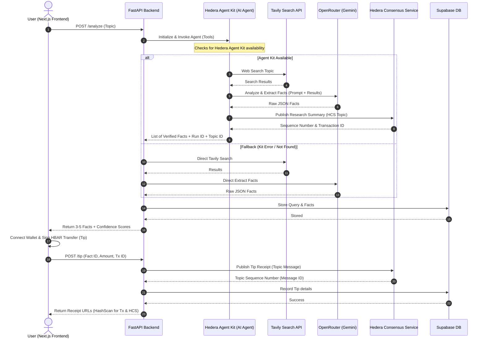
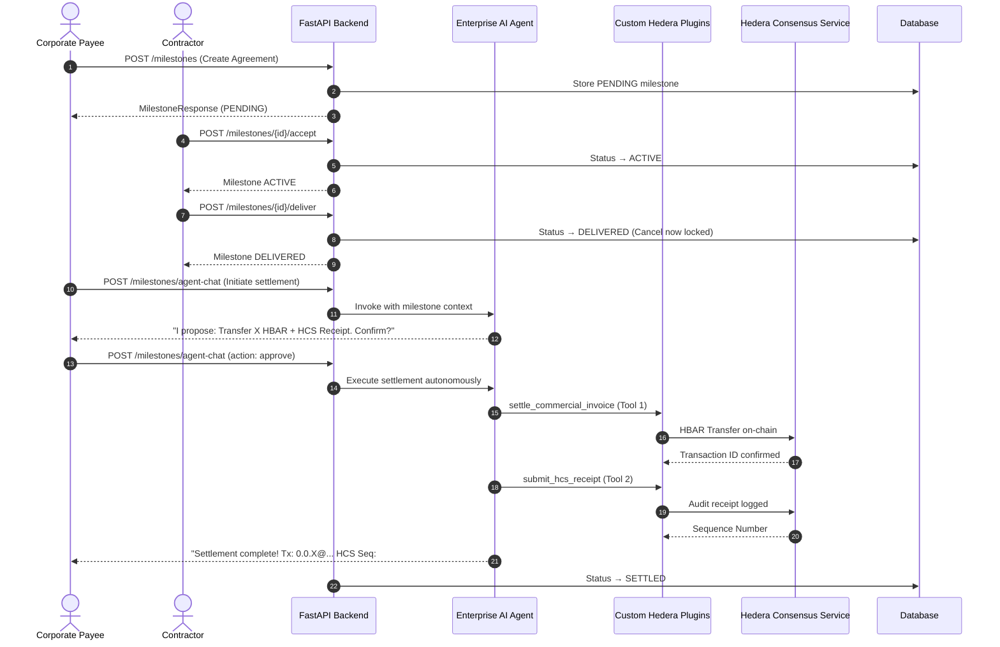

# Hello-Hedera-Pay

### Autonomous AI Treasury & Intelligence Platform — B2B Escrow Settlement & On-Chain Tipping on Hedera

Hello-Hedera-Pay is an enterprise-grade B2B procurement escrow, intelligence, and research platform powered by autonomous AI agents running on the Hedera Agent Kit. The platform operates under two primary business use cases:

1. **AI-Powered Intelligence & Tipping Platform:** Allows users to query any topic, extract deep/underreported facts via advanced LLMs, and tip verified facts using on-chain HBAR.
2. **Secure Multi-State Escrow Trust Machine:** Manages milestone agreements between payees and contractors, locking payments, protecting contractors against payee cancellation post-delivery, and utilizing neutral AI mediation for disputed escrows.

Every transaction, tipping event, and escrow settlement is logged as a cryptographic receipt to the **Hedera Consensus Service (HCS)**, establishing an immutable audit trail.

---

## Multi-State Escrow Trust Machine

For the B2B Procurement Escrow system, a cryptographic game-theory trust machine ensures zero-trust protection:

```
PENDING ──► ACTIVE ──► DELIVERED ──► SETTLED
                │            │
                ▼            ▼
           CANCELLED    DISPUTED (Locked)
```

| State | Who Controls | Description |
| :--- | :--- | :--- |
| **PENDING** | Payee | Agreement drafted. Payee can cancel freely. No funds locked yet. |
| **ACTIVE** | Escrow Vault | Contractor accepts assignment. State machine begins. |
| **DELIVERED** | Locked | Contractor marks work complete. Payee cancel is now BLOCKED. |
| **DISPUTED** | AI/Arbitration | Payee attempted forced cancel. Escrow locked for AI mediation. |
| **SETTLED** | Released | AI Agent executes HBAR transfer + HCS receipt. |
| **CANCELLED** | Refunded | Agreement safely cancelled before delivery. |

> **Rug-Pull Protection:** If a payee attempts to cancel an escrow after the contractor has submitted deliverables (`DELIVERED` state), the system automatically blocks the cancellation and locks the funds into a `DISPUTED` state for neutral AI mediation.

---

## System Architecture

The following sequence diagrams outline the architectures for both primary workflows.

### 1. AI Research & Tipping Architecture
Traces the research execution (using the Hedera Agent Kit and fallback pipelines) and the subsequent on-chain tipping and HCS audit trail.



### 2. B2B Escrow Agreement Lifecycle Architecture
Traces the milestone agreement from creation through acceptance, delivery, automated AI agent settlement, and consensus service receipts.



---

## How We Used Hedera-Agent-Kit

We integrated the **Hedera Agent Kit** in our Python backend ([ai_agent.py](file:///C:/Users/De%20real%20iManuel/Documents/Hello-Hedera-Pay/backend/app/services/ai_agent.py)) to support both autonomous workflows.

### 1. Research Agent Initialization
For research and fact verification, the agent uses LangGraph and OpenRouter's Gemini to extract sources, compute confidence values, and log records:
```python
hedera_agent_kit = importlib.import_module("hedera_agent_kit")
HederaAgentKit = getattr(hedera_agent_kit, "HederaAgentKit")

kit = HederaAgentKit(
    operator_account_id=settings.hedera_account_id,
    operator_private_key=settings.hedera_private_key,
    network=settings.hedera_network,
)
tools = kit.get_tools()
```

### 2. Custom Enterprise Tools for Escrow
For milestone settlement, we registered specialized tools inside the agent framework:
- **Tool 1: `settle_commercial_invoice`**: Executes an autonomous HBAR transfer from the treasury to the contractor.
- **Tool 2: `submit_hcs_receipt`**: Publishes a timestamped, immutable audit receipt to a dedicated Hedera Consensus Service topic.

---

## Issues Faced with Hedera-Agent-Kit

During implementation we encountered several bottlenecks and Python-specific friction points:

1. **Import Naming & Package Inconsistencies:** The package distribution configuration name is `hedera-agent-kit`, but the module must be imported as `hedera_agent_kit`.
2. **Synchronous & Blocking SDK Core:** The underlying Python Hedera SDK operations execute synchronously and block the active event loop, requiring manual offloading to threads:
   ```python
   receipt = await asyncio.wait_for(asyncio.to_thread(_submit_message, message_bytes), timeout=30.0)
   ```
3. **Pydantic v1 vs v2 Conflicts:** The Hedera Agent Kit relies on dependencies adhering to the Pydantic v1 standard, whereas FastAPI, LangChain, and LangGraph use Pydantic v2, causing validation conflicts.
4. **Missing Tool Parity (Python vs TypeScript):** The Python version lacked native HCS Topic creation and publishing tools out-of-the-box compared to the TypeScript variant, requiring standard fallback SDK implementations.
5. **Plaintext Private Key Handling:** The constructor requires a raw private key string in memory, causing issues with enterprise vaults.
6. **SDK Syntax / Naming Conflicts:** Encountered `TopicSubmitTransaction` vs `TopicMessageSubmitTransaction` changes, and Java-style API endpoints (`forTestnet()`, `fromString()`) conflicting with Python's snake_case standards.

---

## Recommendations for the Hedera Team

1. **Standardize on Pydantic v2:** Upgrade dependencies to eliminate type‑checking and schema errors with modern API frameworks.
2. **Native `asyncio` Support:** Rebuild the underlying SDK calls using async/await loops to prevent blocking.
3. **Full Tool Parity:** Bring complete HCS and account creation tools to the Python version of the Agent Kit.
4. **Support Extensible Signer Interfaces:** Allow a signer callback to avoid raw plaintext private key requirements in memory.
5. **Consistent Naming Conventions:** Standardize snake_case interfaces uniformly across the Python SDK.

---

## Repository Structure

```
Hello-Hedera-Pay/
├── backend/                  # FastAPI backend — tipping API, research pipelines, and escrow state machine
│   ├── app/
│   │   ├── routers/
│   │   │   └── milestone.py  # Escrow lifecycle routes (create/accept/deliver/cancel/settle)
│   │   ├── services/
│   │   │   ├── ai_agent.py       # HITL settlement agent, research extraction, and mediation dialogue
│   │   │   └── custom_plugin.py  # Enterprise Hedera Agent Kit tools
│   │   └── db/models.py          # MilestoneRecord with trust state machine columns
├── web/                      # Next.js 15 frontend
│   └── src/app/
│       ├── intelligence-dashboard/  # Dashboards for research, tipping, and procurement
│       ├── about/            # About page
│       ├── docs/             # Developer documentation
│       ├── pricing/          # Pricing plans
│       ├── privacy/          # Privacy policy
│       └── terms/            # Terms of service
├── LICENSE
└── README.md                 # Project documentation and Hedera Agent Kit analysis
```

---

## Tech Stack

| Layer | Technology | Description |
| :--- | :--- | :--- |
| **Frontend** | Next.js 15, React 19, TypeScript, Tailwind CSS | High-performance dashboard, wallet tipping flows, and voice-enabled sidebar. |
| **Backend** | FastAPI, Python, SQLAlchemy (async) | Escrow state machine, AI agent pipelines, HBAR tipping API, and HCS logs. |
| **Agent Kit** | Hedera Agent Kit (LangChain / LangGraph) | Autonomous tooling for HBAR invoice settlement and database research. |
| **AI Engine** | Tavily Search, OpenRouter (Gemini) | Source retrieval, factual analysis, and dispute mediation dialogue. |
| **Blockchain** | Hedera SDK for Python | Direct transaction processing, tipping signatures, and HCS publishing. |
| **Wallet** | HashPack via `@hashgraph/hedera-wallet-connect` | Client-side HBAR signing and transfer execution. |
| **Voice** | Web Speech API + SpeechSynthesis | Browser-native voice recognition and audio playback. |
| **Database** | Supabase (Postgres & Auth) | Secure user authentication, query tracking, facts, and milestones. |

---

## Quick Start

### 1. Database Configuration
Run the following DDL script in your Supabase SQL Editor to establish the data schema:
```sql
create table queries (
  id text primary key,
  user_id uuid not null references auth.users(id) on delete cascade,
  topic text not null,
  created_at timestamptz default now(),
  fact_count int default 0
);

create table facts (
  id text primary key,
  query_id text references queries(id) on delete set null,
  title varchar(200) not null,
  summary text not null,
  confidence float not null,
  sources text default '[]',
  category varchar(200) default '',
  created_at timestamptz default now(),
  agent_run_id varchar(100),
  hcs_topic_id varchar(100)
);

create table tips (
  id text primary key,
  user_id uuid not null references auth.users(id) on delete cascade,
  fact_id text references facts(id) on delete cascade,
  topic text not null,
  amount_hbar float not null,
  transaction_id varchar(200) not null unique,
  hashscan_url text default '',
  hcs_message_id varchar(100) default 'pending',
  hcs_url text default '',
  created_at timestamptz default now(),
  fact_agent_run_id varchar(100),
  fact_hcs_topic_id varchar(100)
);

create table milestones (
  id text primary key,
  user_id uuid references auth.users(id),
  contractor_id text not null,
  contractor_user_id uuid,
  contractor_accepted boolean default false,
  title varchar(200) not null,
  description text not null,
  status varchar(50) default 'PENDING',
  amount_hbar float not null,
  invoice_ref varchar(100) not null unique,
  payment_transaction_id varchar(200),
  reward_token_mint_tx_id varchar(200),
  certificate_nft_id varchar(100),
  hcs_audit_sequence varchar(100),
  created_at timestamptz default now()
);

alter table queries enable row level security;
alter table tips enable row level security;

create policy "users see own queries" on queries for all using (auth.uid() = user_id);
create policy "users see own tips" on tips for all using (auth.uid() = user_id);
```

### 2. Backend Setup
```bash
cd backend
python -m venv .venv
# Activate:
# Linux/macOS: source .venv/bin/activate
# Windows: .venv\Scripts\activate
pip install -r requirements.txt
cp .env.example .env
# Set HEDERA_ACCOUNT_ID, HEDERA_PRIVATE_KEY, HCS_TOPIC_ID, OPENROUTER_API_KEY, TAVILY_API_KEY...
python -m uvicorn app.main:app --reload --port 8000
```

### 3. Frontend Setup
```bash
cd web
npm install
cp .env.example .env.local
npm run dev
```
Client dashboard available at `http://localhost:4028`.

---

## API Reference

| Method | Endpoint | Authorization | Description |
| :--- | :--- | :--- | :--- |
| `POST` | `/analyze` | Supabase JWT | Executes the AI research agent on a given topic and returns facts. |
| `POST` | `/tip` | Supabase JWT | Records a confirmed HBAR tip and submits the receipt to HCS. |
| `GET` | `/history/queries` | Supabase JWT | Returns the history of queries submitted by the user. |
| `GET` | `/history/tips` | Supabase JWT | Returns the history of tipping transactions. |
| `POST` | `/milestones` | Supabase JWT | Create a new escrow agreement. |
| `POST` | `/milestones/{id}/accept` | Supabase JWT | Contractor accepts -> status ACTIVE. |
| `POST` | `/milestones/{id}/deliver` | Supabase JWT | Contractor submits work -> status DELIVERED. |
| `POST` | `/milestones/{id}/cancel` | Supabase JWT | Payee cancels (blocks if DELIVERED -> DISPUTED). |
| `POST` | `/milestones/agent-chat` | Supabase JWT | Voice/text HITL AI settlement conversation. |
| `POST` | `/milestones/settle` | Supabase JWT | Autonomous direct escrow milestone settlement. |

---

## License

MIT — See `LICENSE` for details.
